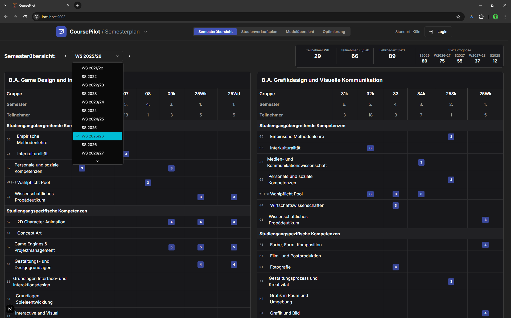
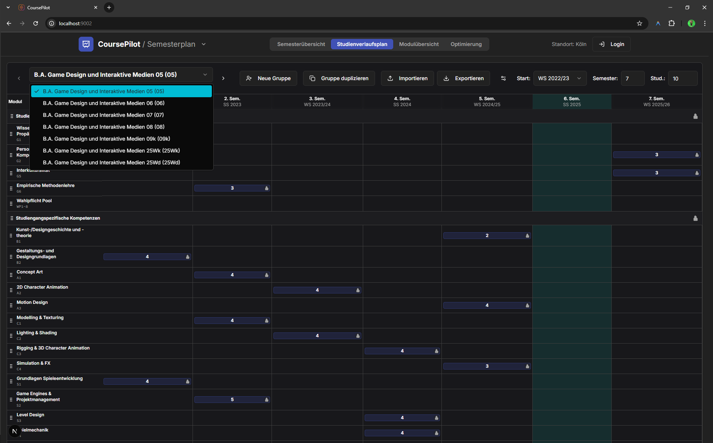

# CoursePilot

CoursePilot is a Next.js application for academic program planning, module administration, room planning, and teaching-load coordination. It is aimed at higher-education teams that need to coordinate cohorts, curricula, room capacity, and semester-by-semester resource demand.

The app currently runs as a local-first planning tool backed by JSON files in `data/`, with optional PocketBase persistence for shared deployments.

## Current Features

- Semester overview across cohorts, programs, modules, participants, and SWS demand.
- Cohort-specific study-progress plans with drag-and-drop module placement.
- Validation for prerequisites, forbidden semesters, duplicate pool modules, and locked modules.
- Module overview and module-sheet editing, including categories, workload, teaching details, room requirements, and program assignment.
- Category, catalog, academic-calendar, and general settings management.
- Room inventory, room occupancy, and room availability views.
- Lecturer overview with assigned modules, daily SWS limits, and availability windows.
- Automated weekly schedule generation based on cohort plans, room capacity/equipment, room blocks, lecturer availability, and conflict checks.
- German and English UI labels.

Several navigation areas are scaffolded for future work. Examinations, user profile, and user groups currently render placeholder screens.

## Screenshots

| Semester overview | Study progress plan |
| --- | --- |
|  |  |

| Module overview |
| --- |
|  |

## Tech Stack

- Next.js 15 with the App Router
- React 18 and TypeScript 5
- Tailwind CSS 3 and shadcn/ui-style components
- Radix UI, lucide-react, Recharts, and @hello-pangea/dnd
- PocketBase client support for optional remote persistence

## Prerequisites

- Node.js 20 or newer
- npm
- Optional: a PocketBase instance with a `CoursePilot` collection containing a JSON `data` field

## Getting Started

Install dependencies:

```bash
npm install
```

Start the Next.js development server:

```bash
npm run dev
```

Open [http://localhost:9002](http://localhost:9002).

The dev script runs `next dev --turbopack -p 9002`.

## Environment Variables

The app works without environment variables by reading and writing the local JSON files in `data/`.

Create `.env.local` only when you want optional integrations:

```env
NEXT_PUBLIC_POCKETBASE_URL=https://your-pocketbase.example.com
```

`NEXT_PUBLIC_POCKETBASE_URL` switches data loading and saving to PocketBase. If the initial PocketBase read fails, the app falls back to local JSON data for that request.

## Data

Local application data lives in `data/`:

- `modules.json`: module catalog and module rules.
- `programs.json`: degree programs and template plans.
- `cohorts.json`: active cohort instances and their plans.
- `categories.json`: module categories.
- `catalogs.json`: selectable values such as exam types and teaching methods.
- `users.json`: user records for planned user-management features.
- `rooms.json`: room inventory.
- `room-occupancy.json`: room assignments.
- `system-settings.json`: global planning settings.
- `academic-calendar.json`: semester periods and academic-year settings.
- `lecturer-availability.json`: weekly availability and daily SWS limits for teaching staff.
- `schedule.json`: the latest generated weekly schedule.

The API route at `src/app/api/data/route.ts` reads this data through `src/lib/data-service.ts` and saves UI changes back after edits.

## PocketBase

PocketBase is optional. When `NEXT_PUBLIC_POCKETBASE_URL` is set, CoursePilot reads and writes the first record in the `CoursePilot` collection and expects a JSON field named `data`.

Current PocketBase saves include the core planning and room-planning payload: modules, programs, cohorts, categories, rooms, and room assignments. Local JSON mode persists the full set of files listed above.

For local-data migration, review and run:

```bash
node migrate-to-pb.js
```

Note: `migrate-to-pb.js` currently targets the configured hosted PocketBase instance in the script. Update it before using a different instance.

## Scripts

```bash
npm run dev           # Start Next.js on port 9002 with Turbopack
npm run build         # Create a production build
npm run start         # Start the production server
npm run lint          # Run Next linting
npm run typecheck     # Run TypeScript without emitting files
```

## Project Structure

```text
src/app/                 Next.js routes, layout, API routes, and CoursePilot client shell
src/components/          Planner, module, room, settings, and UI components
src/lib/                 Data service, PocketBase client, and utilities
src/hooks/               Shared React hooks
src/types.ts             Shared application types
src/translations.ts      German and English UI strings
data/                    Local JSON persistence
docs/                    Project notes, research material, and module-description PDFs
screenshots/             README screenshots
```

## Production

Build the app:

```bash
npm run build
```

Run the production server:

```bash
npm run start
```

CoursePilot uses server-side API routes for data access, so deploy it to an environment that supports Node.js.

## License

Copyright (c) 2026 Seb Hirsch. All rights reserved.

This software is provided as "source available". Use, reproduction, or distribution is prohibited without explicit written permission. See [LICENSE.md](LICENSE.md) for details or contact [seb@coursepilot.de](mailto:seb@coursepilot.de) for inquiries.

## Status

CoursePilot is in active development. The core planning, module, room, and settings surfaces are present; several administrative areas are intentionally scaffolded as placeholders.
